# Android-nRF-UART

nRF UART app can be used to connect to Bluetooth® Smart devices running a custom Nordic Semiconductor UART service. When connected, the app can send and receive ASCII and UTF-8 text strings. 

This app works with the ble_app_uart project in the nRF51 SDK and the Bluetooth Smart SDK for Arduino. 

This app created as a demonstration for handling 128 bit proprietary UUID service and characteristics. 

This source code can be compiled with Android Studio and Gradle. 

## Modification

This fork of the Android-nRF-UART App has this modifikations:

- send more than 20 Bytes via a loop (Text field: MaxLeng 168)
- gets and sends android status bar notifications
- works with a non nRF Module like HM-10

## Note
- Android 4.4 or later is required.
- Android Studio supported 

## What did I do?

### the arduino code

I write a small Terminal firmware for the Arduino. Serial chars are printed
to the SSD1306 OLED Display (max. 168, then refresh the display).

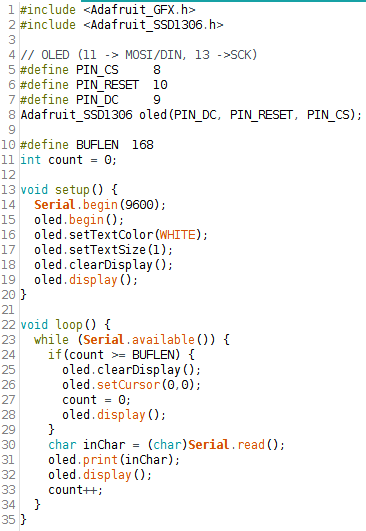

### Circuit

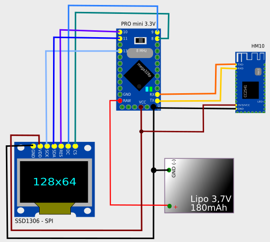

### Android App (thanks to Nordic Semicoductor to make it Open Source!)

I change the maxLength of the sendText object in res/layout/main.xml (Android App) from
20 to 168.

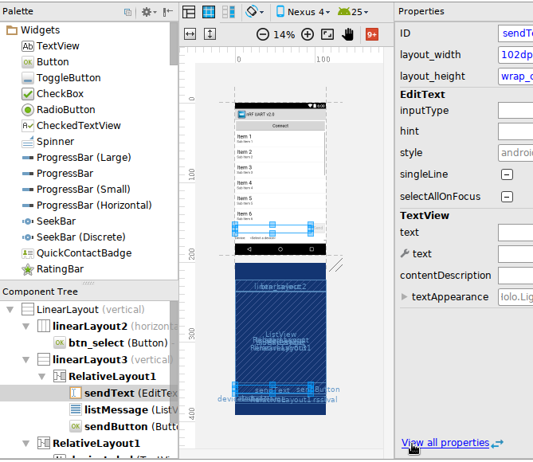

I simplify the sending method of UartService.java to make it easier to understand ...

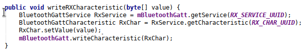

... and make it a bit complicated again. This loop sends the bytes (max 20) in 60ms
intervalls:

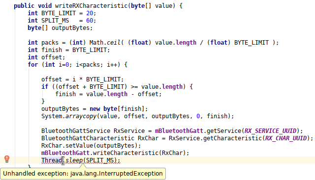

I have to add a try/catch:

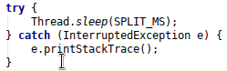

I do some modifications at the to of UartService.java to work with a HM-10 (not the realy
good nordic Semiconductor!) Module:

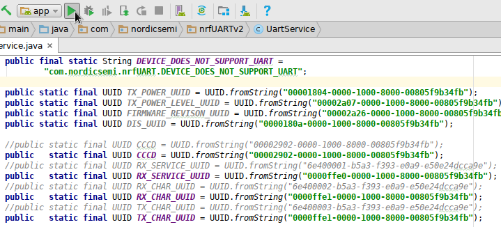

Now, I modify the AndroidManifest.xml and add the Notfication Service to listen to the
status bar notifications.

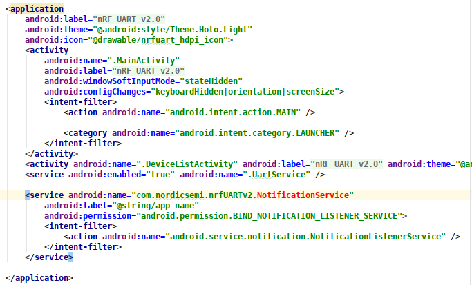

I modify the app/build.gradle to build the App for Android 4.4 (19) instead for Android 4.3 (18).
On Android 4.4 it is easier to access the notification text. (do not forget to Sync the Project).

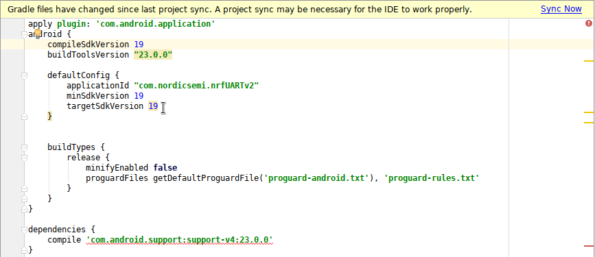

I create a NotificatonService.class and get new status bar notifications. I remove (do a return;) the
uninteressting ones. After a have some message, I broadcast this message from the Notification Service
to the hole Android System with an intent object.

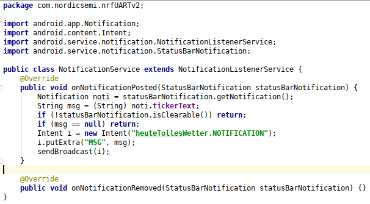

In the Main App Activity (MainActivity.java) we need a BroadcastReceiver to handle this intent. I
call this class NotificationReceiver.

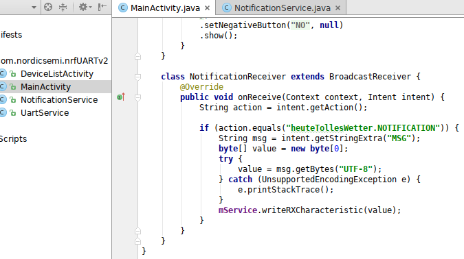

I need an instance of this new NotificationReceiver at the top of the MainActivity.java: I call it nReceiver:

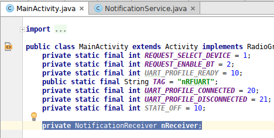

Finaly, I have to add a filter and register this nReceiver, to listen to "heuteTollesWetter.NOTIFICATION"
intents. I am not sure, if you realy add this filter - I filter this intents via getAction() in the
NotificationReceiver, too.

You have to add the Code in the onCreate() methode:

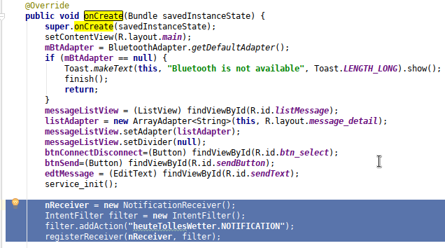

## Permissions to Notifications

The App whats to get this permisson: BIND_NOTIFICATION_LISTENER_SERVICE. To permit these permissions,
you have to give it via your settings on your mobile:

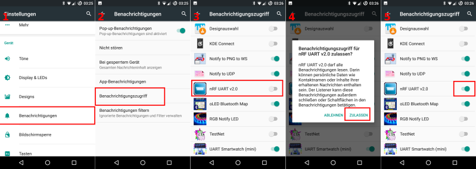
