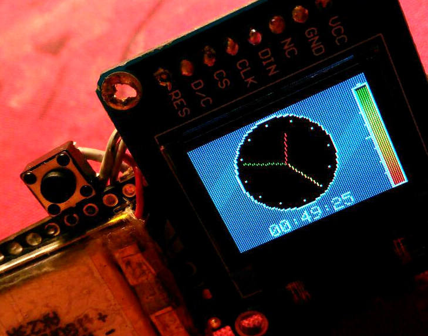

# UART Smartwatch

## UART Smartwatch

Die Idee

## UART Smartwatch

 -  Handy in Tasche pipt - Wichtig?
 -  Nachrichten und Zeit vom Handy
 -  UART Bluetooth
 -  OLED Display
 -  DEINE EIGENEN MODS!!

## Bauteile

Bauteile

## Bauteile

Erster Prototyp teuer (deutsche Händler):

 -  [Bluefruit LE UART](https://learn.adafruit.com/introducing-the-adafruit-bluefruit-le-uart-friend/introduction) (19 EUR)
 -  [SparkFun Micro OLED](https://learn.sparkfun.com/tutorials/micro-oled-breakout-hookup-guide) (17 EUR)
 -  [Adafruit Pro Trinket 3V, 12MHz](http://www.exp-tech.de/adafruit-pro-trinket-3v-12mhz) (10 EUR)
 -  Lipo 3,7V - 180mAh (6 EUR)

ergibt 52 EUR :-(

## teurer Prototyp

## teurer Prototyp

## Bauteile Low Cost (Asien):

 -  [Bluetooth HM-10](http://www.instructables.com/id/How-to-Use-Bluetooth-40-HM10/) (2,60 EUR)
 -  [ssd1306 SPI OLED](https://learn.adafruit.com/monochrome-oled-breakouts/arduino-library-and-examples) (2,80 EUR)
 -  [Pro Mini 3V 8MHz](https://www.arduino.cc/en/Main/ArduinoBoardProMini) (1,60 EUR)
 -  Lipo 3,7V - 180mAh (5,50 EUR)

ergibt ca 13 EUR :-D

## billige Version

## billige Version

# Low Cost vs teuer

## Low Cost vs teuer

Low Cost vs teuer

## Low Cost vs teuer

 -  Display mit 128x64 statt 64x48 ist billiger (braucht mehr RAM)
 -  Programmieren nur mit Zusatz Hardware
 -  bis zu 60 Tage Lieferzeit
 -  Bluefruit = 3mA , HM10 Modul = 10mA

Fazit: Kompromisse finden. Dumm, wenn Display aus und Arduino im Sleep Modus
trotzdem Akku keine 8h durchhält. In der teuren Version: 30h !!!

# Akku Laufzeit

## Akku Laufzeit

Akku Laufzeit

## Akku Laufzeit

[Sleep Modus](http://playground.arduino.cc/Learning/ArduinoSleepCode) des Ardino Mini brachte 30h, aber:

1)  Uhr zählte Sekunden nicht selbst
2)  Uhr musste immer Zeit holen
3)  Wann ist Akku wirklich leer? Abnutzung?
4)  keine LED Benachritigung bei neuen Nachrichten
5)  Mit 3 EUR mehr: besseres Bluetooth Modul?

zu 4: Mit UART Arduino aufwachen lassen - Der Sleep Modus bringt nicht
viel

[github.com/no-go/Bluetooth-Smartwatch](https://github.com/no-go/Bluetooth-Smartwatch)

# Mini Beispiel

## Mini Beispiel

Mini Beispiel

[no-go.github.io/Android-nRF-UART](https://no-go.github.io/Android-nRF-UART)

## Mini Beispiel - Schaltung

## Mini Beispiel - Firmware

## Mini Beispiel - Android App (1)

 -  Mit [Android Studio](https://developer.android.com/studio/) kostenlos selber Apps machen
 -  Nordic Semiconductor: UART App
 -  viel OpenSource + Beispiel
 -  ein *rooten* ist nicht nötig

## Mini Beispiel - Android App (2)

Download der UART Terminal App von github

[github.com/NordicSemiconductor/Android-nRF-UART](https://github.com/NordicSemiconductor/Android-nRF-UART)

und öffnen in Android Studio :-D

## Mini Beispiel - Android App (3)

## Mini Beispiel - Android App (4)

Änderungen der App

 -  Eingabefeld von 20 auf 168 Zeichen vergrößern
 -  Schleife, in 20 Zeichen Intervallen zu senden
 -  Anpassen auf *billig Bluetooth Modul*
 -  Benachrichtigungs Diensts erstellen
 -  Nachrichten durch App/Activity senden lassen

## Mini Beispiel - Android App (5)

Von mir detailiert beschrieben mit Screenshots auf: [no-go.github.io/Android-nRF-UART](https://no-go.github.io/Android-nRF-UART)

# Farbdisplay

## Farbdisplay

Farbdisplay

## Farbdisplay

SSD1331 nicht viel anders als SSD1306

 -  Anschluss identisch
 -  langsamer (16 statt 1 Bit pro Pixel)
 -  teurer (min 10 EUR statt 3 EUR)
 -  Icons, Bilder, Emoticons möglich

## Farbdisplay Experimente

## Farbdisplay Experimente

## Quellen

 -  App und Firmware [github.com/no-go/UART-Smartwatch/tree/gplay](https://github.com/no-go/UART-Smartwatch/tree/gplay)
 -  mini Beispiel [no-go.github.io/Android-nRF-UART](https://no-go.github.io/Android-nRF-UART)
 -  Artikel vibora.de [vibora.de/2016/04/do-it-yourself-smartwatch.html](http://vibora.de/2016/04/do-it-yourself-smartwatch.html)
 -  Farbdisplay Arduino [github.com/no-go/UART-Smartwatch/tree/ssd1331](https://github.com/no-go/UART-Smartwatch/tree/ssd1331)
 -  oLED Bluetooth Map [no-go.github.io/oLEDBluetoothMap](https://no-go.github.io/oLEDBluetoothMap)

## Danke

Fragen?
